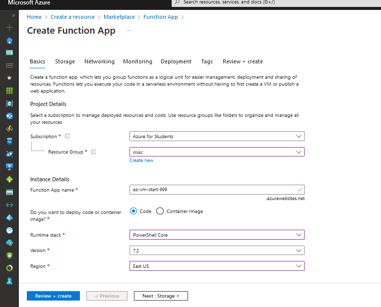
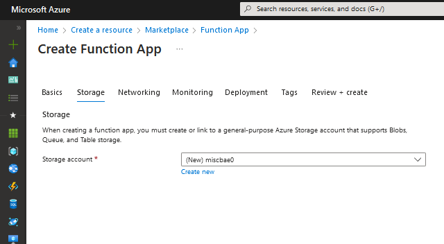
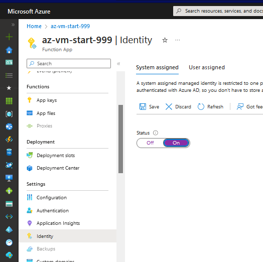
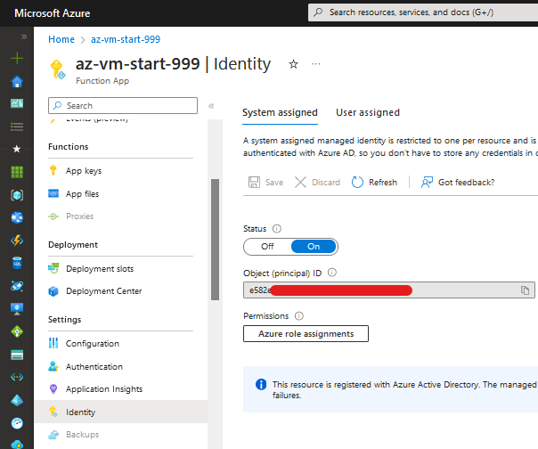
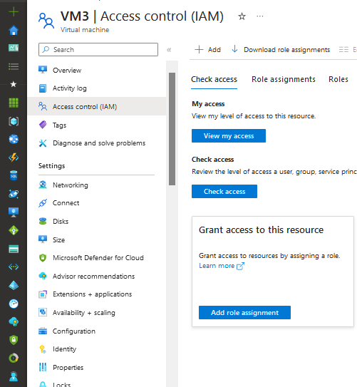
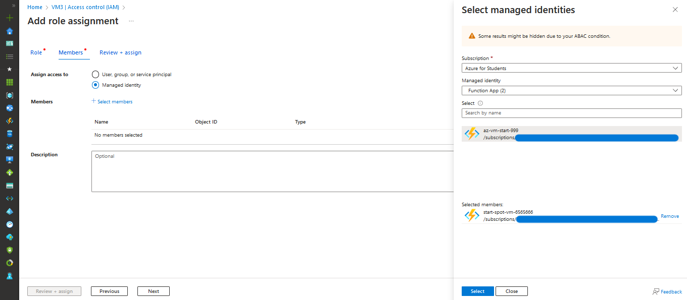
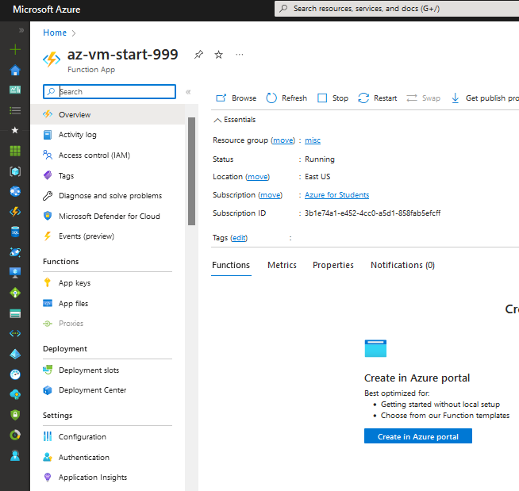
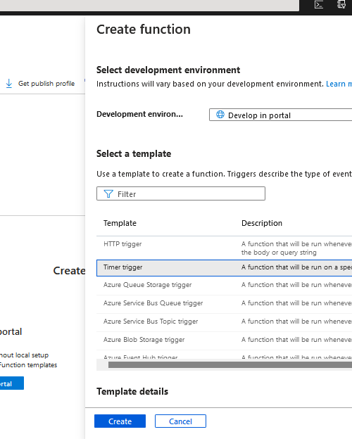
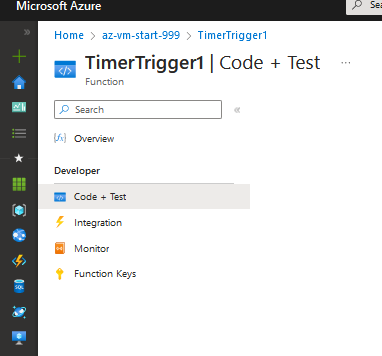

## Autostart Azure Spot Virtual Machine and send webhook notification
This azure function is used to start a VM if it is not running, and send a notification to gotify if it is running,

This is used to start a spot VM that is stopped due to low capacity

This is triggered by a webhook, But can be triggered by a timer or queue if needed.

## Note: 
* Use run_http_trigger.ps1 for a webhook trigger, and run_timer_trigger.ps1 for a timer trigger
* This is a simple example, and can be expanded to do more things, like starting multiple VMs, or sending notifications to multiple services, or even starting a VM on a schedule.

## Environment Variables

This function uses the following environment variables:

- `SUBSCRIPTION_ID`: Your Azure subscription ID where the VMs are located
- `VM_TO_START`: (Optional) The name of a specific VM to start if it's shut down. When set, the function will look for this VM across all resource groups in the subscription and start it if it's deallocated or stopped.

### Manual VM Start Feature

The function now supports starting a specific VM by setting the `VM_TO_START` environment variable. This is useful when you want to start a particular VM on-demand:

1. Set the `VM_TO_START` environment variable to the name of your VM
2. The function will search for the VM across all resource groups in the subscription
3. If found and the VM is deallocated/stopped, it will be started
4. The function logs the VM's current status and any actions taken

Example: If you set `VM_TO_START=my-spot-vm`, the function will automatically start that VM if it's not running.

### Configuration for Deployment

When deploying to Azure, make sure to set these environment variables in your Function App's Application Settings:

1. Go to your Function App in the Azure Portal
2. Navigate to Settings > Environment Variables (or Configuration)
3. Add the following application settings:
   - `SUBSCRIPTION_ID`: Your Azure subscription ID
   - `VM_TO_START`: The name of the VM you want to auto-start (optional)

For local development, update the `local.settings.json` file with these values.

# How to use
## Create Function App

Click Create a resource and select Function App. Give it a nice name, such as az-vm-start-999.

Runtime stack means what language we would like to write the Function logic. Azure Function provides support for mainstream languages or platforms such as .NET, Java, Node.js, Python, and PowerShell Core. Here I will choose PowerShell Core.
Select Consumption (Serverless) for Plan type, this Plan can be billed dynamically according to your usage, which helps save money when the usage is small.

Next, we have to create or select a Storage Account, which is required by the latest version of Azure Function V3, u can leave this as default

Click Review + create to create the Function App.

## Prepare the Function permissions
After the creation is completed, we need to configure permissions for this Function App to access VM.

Under the Identity menu, turn on the System assigned switch. 
This authorization method allows Azure resources to authorize each other within a few mouse click.

Now go to your VM management screen, go to Access control (IAM) and select Add > Role Assignment

In the Role tab, Search and Select  Virtual Machine Contributor role, Then click next

Go to Member and after selecting Managed Identity select the function app you created, and select your subscription, then select the function app you created

And you are Done setting up permission, now u can edit the run.ps1 file in the function app with your VM name, resource group name, Subscription ID, and tenantId and save/copy it to the function app.

## Function App Configuration

Here we have sevaral option to setup the function app, we can use a timer, a webhook, or a queue, in this example we will use a timer, but you can use a webhook if you want to trigger it from outside azure. A timer is the easiest way to trigger it, and you can set it to run every 5 minutes or so(High consumption of the function app will cost you more money), and it will check if the VM is running, if it is not running it will start it, and if it is running it will send a notification to gotify.

Go to the created Function App, and create a new Function, select timer trigger or Http trigger, and give it a name, and set the schedule to your liking, and click create

And lastly go to code + test, and paste the code from either from run_http_trigger.ps1 or from run_timer_trigger.ps1 depending on your function app, and save it, and you are done, you can test it by clicking run, and you can see the logs in the log tab.

Inspired by
http://web.archive.org/web/20230328044754/https://edi.wang/post/2020/6/18/use-azure-function-to-schedule-auto-start-for-vms
